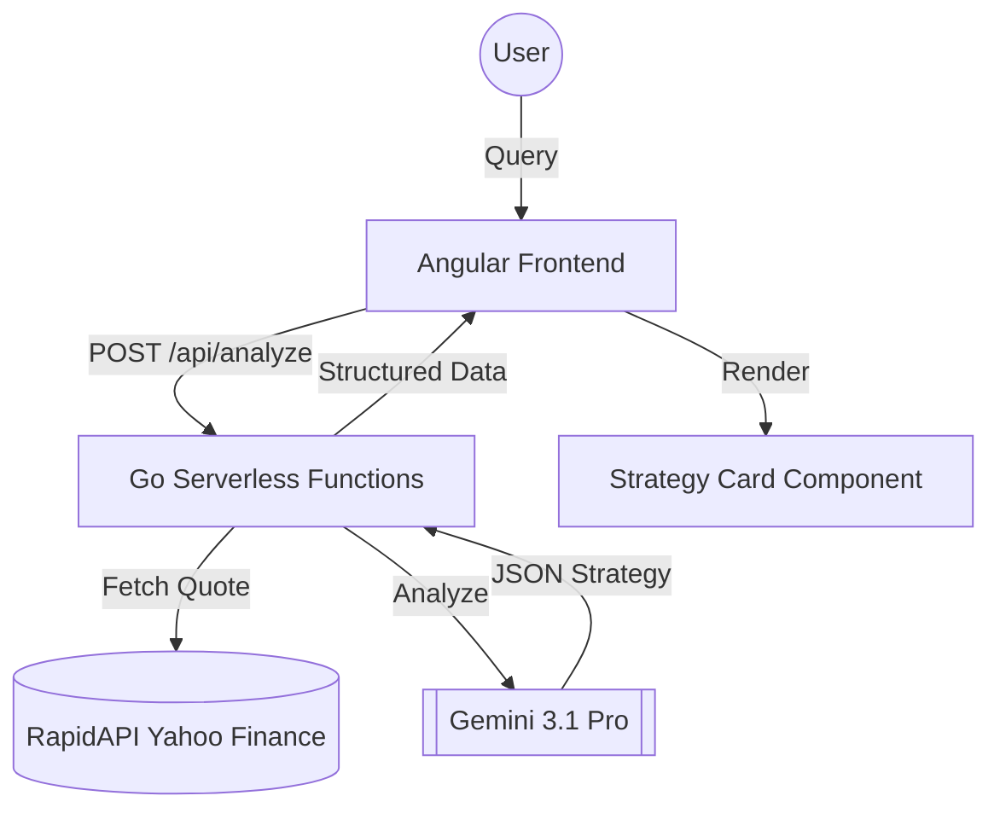

# 🤖 Aura — The Swing-Trade Co-Pilot
> **Master Product Requirements Document (PRD)**

| Metadata | Details |
| :--- | :--- |
| **Developer** | Andi Alifsyah Dyasham |
| **Target Deadline** | May 2, 2026 (23.59 WIB) |
| **Deployment Target** | Vercel (Monorepo with Serverless Functions) |

---

## 📌 Table of Contents
- [1. Executive Summary & Challenge Fulfillment](#1-executive-summary--challenge-fulfillment)
- [2. Character Identity & Visual Branding](#2-character-identity--visual-branding)
- [3. Technical Architecture](#3-technical-architecture)
- [4. Directory Structure](#4-directory-structure)
- [5. Core Data Models](#5-core-data-models)
- [6. Backend API Specifications](#6-backend-api-specifications)
- [7. Frontend Component Specifications](#7-frontend-component-specifications)
- [8. End-to-End User Flow](#8-end-to-end-user-flow)

---

## 1. Executive Summary & Challenge Fulfillment
Aura is an agentic AI web application designed for retail stock investors focusing on short-term swing trades and **BSJP (Beli Sore Jual Pagi)** strategies on the Indonesian Stock Exchange (IDX).

> [!IMPORTANT]
> **WealthyPeople Stage 2 Challenge Fulfillment**
> - **AI is Central**: Aura utilizes a Retrieval-Augmented Generation (RAG) agentic workflow. She pulls live market data via RapidAPI, analyzes it using Google's Gemini 3.1 Pro, and outputs strict JSON to generate functional UI components.
> - **Character Representation**: Aura is visually represented as a Localized Fintech Professional, giving the AI a distinct, branded personality.
> - **Functional Web Experience**: Built with Angular and Golang, fully deployed on Vercel.
> - **Originality**: Solves the problem of emotional trading by forcing an LLM to output structured quantitative data rather than conversational text.

---

## 2. 👩‍💼 Character Identity & Visual Branding

| Attribute | Specification |
| :--- | :--- |
| **Name** | Aura |
| **Role** | Lead System Architect & Quantitative Analyst |
| **Persona** | Hyper-logical, risk-averse, and highly structured. Speaks in technical certainties and probabilities. |
| **UI Aesthetic** | Dark mode (Slate-900/800) with Neon Green (#4ade80) and Red (#f87171) accents. |

> [!TIP]
> **Visual Identity**: A professional female financial analyst in a dark corporate blazer over a modern slim-fit batik shirt.
> 
> 

### Environment Variables
To run this project, the following keys must be configured in your Vercel environment or `.env` file:

| Variable | Description |
| :--- | :--- |
| `GEMINI_API_KEY` | Your Google AI Studio API Key (for Gemini 3.1 Pro). |
| `RAPIDAPI_KEY` | Your RapidAPI Key for Yahoo Finance data. |
| `RAPIDAPI_HOST` | `yahoo-finance15.p.rapidapi.com` |

---

## 3. 🏗️ Technical Architecture
Aura uses a Vercel-optimized Monorepo to maintain security and performance.



---

## 4. 📂 Directory Structure
```text
/aura-trade
├── /api                      # Vercel Go Serverless Functions
│   ├── analyze.go            # Handles chat queries, RapidAPI fetch & Gemini API
│   ├── top-picks.go          # Handles the daily screener mock data
│   └── go.mod
├── /asset                    # Visual Assets
│   ├── Aura.png              # Full character with background
│   └── AuraProtrait.png      # Character portrait
├── /src                      # Standard Angular Application
│   ├── /app
│   │   ├── /components
│   │   │   ├── chat/         # Message logic & Aura interaction
│   │   │   ├── strategy-card/# Visual setup card
│   │   │   └── top-picks/    # Horizontal screener bar
│   │   ├── /services
│   │   │   └── trade.service.ts
├── vercel.json               # Routes /api -> Go, /* -> Angular
└── tailwind.config.js
```

---

## 5. 📊 Core Data Models

### Strategy Card Data
Used for passing structured trade setups from AI to UI.

```typescript
export interface StrategyCardData {
  ticker: string;         // e.g., "BMRI.JK"
  confidence: number;     // 0-100
  entry: number;          // e.g., 6500
  takeProfit: number;     // e.g., 6800
  stopLoss: number;       // e.g., 6300
  rationale: string;      // Max 2 sentences technical setup
}
```

---

## 6. ⚙️ Backend API Specifications

### `POST /api/analyze`
| Phase | Logic |
| :--- | :--- |
| **Preprocessing** | Parse ticker and append `.JK` if missing. |
| **Data Fetch** | Call Yahoo Finance API for live price/volume. |
| **Prompting** | Instruct Gemini as "Aura" to output strict JSON based on live data. |
| **Response** | Return `StrategyCardData` JSON object. |

### `GET /api/top-picks`
| Logic | Output |
| :--- | :--- |
| Hardcode high-liquidity stocks (BMRI.JK, BREN.JK, GOTO.JK). | Array of `{ ticker, currentPrice, percentChange }`. |

---

## 7. 💻 Frontend Component Specifications

### A. TopPicksComponent
- **Location**: Fixed horizontal bar at the top.
- **Behavior**: Calls `/api/top-picks` on init. Clicking a card auto-fills chat with *"Give me the setup for [Ticker]"*.

### B. ChatComponent
- **Behavior**: Maps through `ChatMessage` array.
- **UX**: Shows a glowing CSS spinner: *"Aura is fetching live market data..."* during analysis.

### C. StrategyCardComponent
- **Inputs**: `@Input() data: StrategyCardData`
- **UI**: Slate-800 card with data grid showing Confidence bar, Entry, TP (Green), and SL (Red).
- **Action**: "Set Alert" button triggers a Toast: *"✅ Alert Set: Aura is monitoring {ticker}."*

---

## 8. 🔄 End-to-End User Flow

```mermaid
sequenceDiagram
    participant U as User
    participant A as Angular
    participant G as Go (API)
    participant AI as Gemini 1.5
    
    U->>A: Clicks Top Pick or Types Ticker
    A->>G: POST /api/analyze {ticker}
    Note right of G: Fetch Live Market Data
    G->>AI: Raw Data + Agentic Prompt
    AI-->>G: Validated JSON Strategy
    G-->>A: StrategyCardData
    A->>U: Render Sleek Strategy Card
    U->>A: Click "Set Alert"
    A->>U: Toast: "Monitoring {ticker}..."
```
